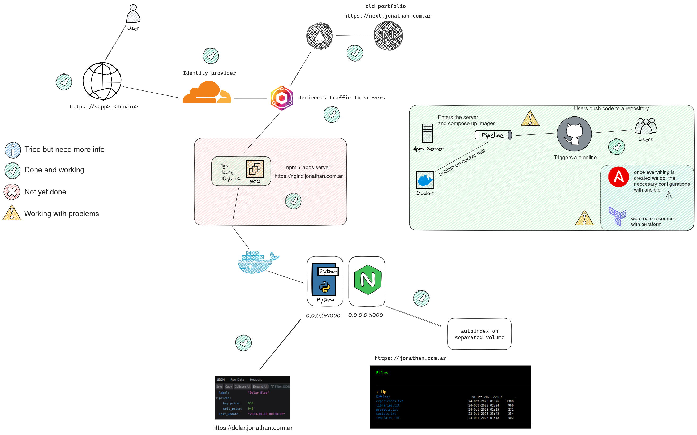

# jd-infra 🖥 

  

I'm migrating from digital ocean to AWS/Vercel, so I'm using this repo to keep track of my progress, everything I do with my infrastructure will be here, and most of the things are for learning purposes.

# Table of Contents 📑

1. [jd-infra 🖥](#jd-infra-)
2. [Status 📊](#status-)
3. [Work in progress 🧰](#work-in-progress-)
4. [Documentation 📝](#documentation-)
5. [Stack 📚](#stack-)

## Status 📊

- [x] Design infrastructure
- [x] Documentation
- [x] Script to run Terraform
- [x] Vercel app
- [x] Mail forwarding
- [x] Blog
- [x] Domains
- [x] AWS EC2 Running
- [x] Build Terraform modules
- [x] Build Makefile
- [x] Build Ansible playbooks
- [x] Use Nginx Proxy Manager
- [x] SSH access to EC2 / Session Manager
- [x] Add cloudflare as proxy
- [x] Docker apps running on EC2

## Work in progress 🧰

## Documentation 📝

In deep documentation about how everything went can be checked in [docs](./docs/README.md).

Expecification about other things can be found in nested folders like

- Networking [docs/networking](./docs/networking/README.md)
- Email [docs/email](./docs/email/README.md)

## Stack 📚

- [Terraform](https://www.terraform.io/)
- [Ansible](https://www.ansible.com/)
- [AWS](https://aws.amazon.com/)
- [Docker](https://www.docker.com/)
- [NPM](https://nginxproxymanager.com/)
- [Grafana](https://grafana.com/)
- [Bash](https://www.gnu.org/software/bash/)
- [Excalidraw](https://excalidraw.com/)
- [Snyk](https://snyk.io/)
- [Improvmx](https://improvmx.com/)
- [Hashnode](https://hashnode.com/)
- [Vercel](https://vercel.com/)