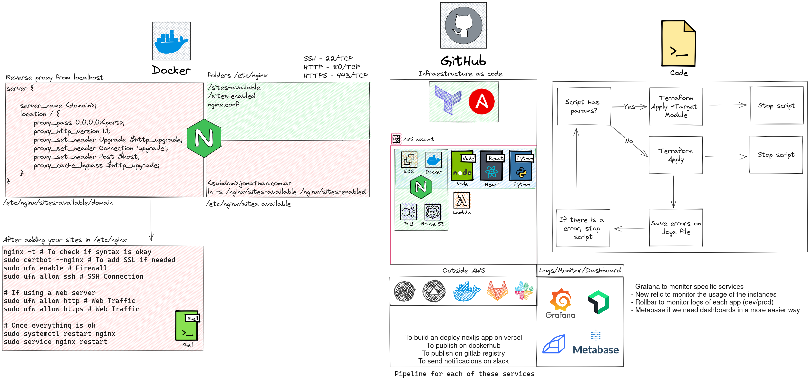

# jd-infra 🖥 

I'm migrating from digital ocean to AWS, so I'm using this repo to keep track of my progress.

## Work in progress 🧰



My last braincell is working on this repo, so please be patient.


## Folder structure 📂

```
🌳 jd-infra/
┣ 📁 ansible/
┃ ┗ 📄 .gitkeep
┣ 📁 scripts/
┃ ┣ 📄 .gitkeep
┃ ┣ 📄 install-certbot.sh
┃ ┣ 📄 install-docker.sh
┃ ┗ 📄 install-nginx.sh
┣ 📁 terraform/
┃ ┣ 📁 modules/
┃ ┃ ┣ 📁 aws/
┃ ┃ ┃ ┣ 📄 output.tf
┃ ┃ ┃ ┣ 📄 provider.tf
┃ ┃ ┃ ┣ 📄 resources.tf
┃ ┃ ┃ ┣ 📄 secret.tfvars
┃ ┃ ┃ ┗ 📄 variables.tf
┃ ┃ ┣ 📁 docker/
┃ ┃ ┃ ┣ 📄 provider.tf
┃ ┃ ┃ ┣ 📄 resources.tf
┃ ┃ ┃ ┣ 📄 secret.tfvars
┃ ┃ ┃ ┗ 📄 variables.tf
┃ ┃ ┗ 📁 vercel/
┃ ┃   ┣ 📄 provider.tf
┃ ┃   ┣ 📄 resources.tf
┃ ┃   ┣ 📄 secret.tfvars
┃ ┃   ┗ 📄 variables.tf
┃ ┣ 📄 main.tf
┃ ┗ 📄 versions.tf
┣ 📄 .gitignore
┣ 📄 LICENSE
┣ 📄 Makefile
┗ 📄 README.md
```

## Stack 📚

- [Terraform](https://www.terraform.io/)
- [Ansible](https://www.ansible.com/)
- [AWS](https://aws.amazon.com/)
- [Docker](https://www.docker.com/)
- [Nginx](https://www.nginx.com/)
- [Grafana](https://grafana.com/)
- [Bash](https://www.gnu.org/software/bash/)
- [Excalidraw](https://excalidraw.com/)