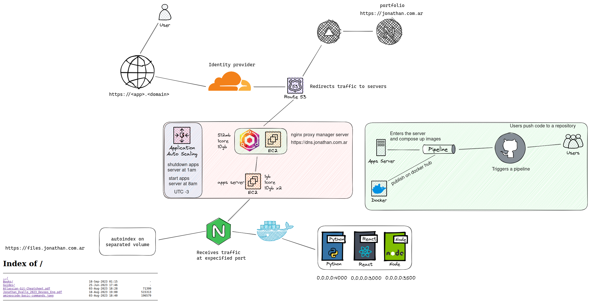

# jd-infra 🖥 

I'm migrating from digital ocean to AWS/Vercel, so I'm using this repo to keep track of my progress.

Why not amplify? Praise the sun, I mean, praise the free tier.

## Status 📊

- [x] Design infrastructure
- [x] Documentation
- [x] Script to run Terraform
- [x] Vercel app
- [x] Mail forwarding
- [x] Blog
- [x] Domains
- [x] AWS EC2 Running
- [x] Build Terraform modules
- [x] Build Makefile
- [ ] Docker apps running on EC2
- [ ] Redirrect traffic through Cloudflare
- [ ] Build Ansible playbooks
- [ ] Grafana/New Relic
- [ ] Use Nginx Proxy Manager
- [ ] Use Watchtower
- [ ] SSH access to EC2 / Session Manager
- [ ] Lambda functions

In deep documentation about how everything went can be checked in [docs](./docs/README.md).

Expecification about other things can be found in nested folders like

- Networking [docs/networking](./docs/networking/README.md)
- Email [docs/email](./docs/email/README.md)

## Work in progress 🧰



My last braincell is working on this repo, so please be patient.


## Folder structure 📂

```
🌳 jd-infra/
┣ 📁 .github/
┃ ┗ 📁 workflows/
┃   ┣ 📄 git-leaks.yml - Security
┃   ┗ 📄 snyk-security.yml - Security
┣ 📁 ansible/
┃ ┣ 📁 files/
┃ ┃ ┣ 📄 jonathan.com.ar - In case we use nginx in the server
┃ ┃ ┗ 📄 nginx.conf
┃ ┣ 📁 inventory/
┃ ┃ ┣ 📄 .gitkeep
┃ ┃ ┗ 📄 hosts - Server IP are here
┃ ┣ 📁 playbook/
┃ ┃ ┣ 📄 cronjobs.yml
┃ ┃ ┣ 📄 nginx.yml
┃ ┃ ┗ 📄 prepare.yml
┃ ┗ 📄 .gitkeep
┣ 📁 design/
┃ ┣ 📄 Infra.png - Second design
┃ ┣ 📄 Infra_V1.png - First design
┃ ┣ 📄 Infra_V2.png - Third design
┃ ┗ 📄 Infra_V3.png - Actual design
┣ 📁 docs/
┃ ┣ 📁 email/
┃ ┃ ┣ 📄 README.md
┃ ┃ ┗ 📄 improvmx.png
┃ ┣ 📁 networking/
┃ ┃ ┣ 📄 README.md
┃ ┃ ┣ 📄 aws.png
┃ ┃ ┣ 📄 digital_ocean.png
┃ ┃ ┗ 📄 nic.png
┃ ┗ 📄 README.md - Personal notes about how everything went
┣ 📁 scripts/
┃ ┣ 📄 .gitkeep
┃ ┣ 📄 install-certbot.sh
┃ ┣ 📄 install-docker.sh
┃ ┣ 📄 install-nginx.sh
┣ 📁 terraform/
┃ ┣ 📁 config/
┃ ┃ ┣ 📄 .gitkeep
┃ ┃ ┣ 📄 dev.tfvars
┃ ┃ ┗ 📄 prod.tfvars
┃ ┣ 📁 modules/
┃ ┃ ┣ 📁 aws/
┃ ┃ ┃ ┣ 📄 output.tf
┃ ┃ ┃ ┣ 📄 provider.tf
┃ ┃ ┃ ┣ 📄 resources.tf
┃ ┃ ┃ ┗ 📄 variables.tf
┃ ┃ ┣ 📁 docker/
┃ ┃ ┃ ┣ 📄 provider.tf
┃ ┃ ┃ ┣ 📄 resources.tf
┃ ┃ ┃ ┗ 📄 variables.tf
┃ ┃ ┗ 📁 vercel/
┃ ┃   ┣ 📁 app/
┃ ┃   ┣ 📄 provider.tf
┃ ┃   ┣ 📄 resources.tf
┃ ┃   ┗ 📄 variables.tf
┃ ┣ 📄 Makefile
┃ ┣ 📄 main.py
┃ ┣ 📄 main.tf - Call modules here
┃ ┗ 📄 versions.tf
┣ 📄 .gitignore
┣ 📄 .gitmodules
┣ 📄 LICENSE
┣ 📄 Makefile
┗ 📄 README.md
```

## Stack 📚

- [Terraform](https://www.terraform.io/)
- [Ansible](https://www.ansible.com/)
- [AWS](https://aws.amazon.com/)
- [Docker](https://www.docker.com/)
- [Nginx](https://www.nginx.com/)
- [Grafana](https://grafana.com/)
- [Bash](https://www.gnu.org/software/bash/)
- [Excalidraw](https://excalidraw.com/)
- [Snyk](https://snyk.io/)
- [Improvmx](https://improvmx.com/)
- [Hashnode](https://hashnode.com/)
