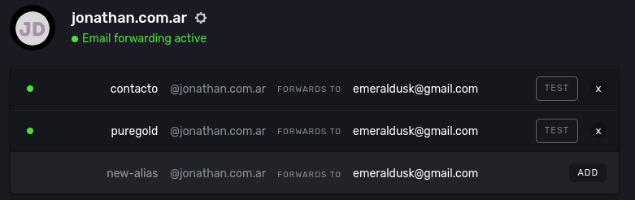

I'm using [improvmx](https://improvmx.com/) to forward emails to my personal email address.

What is needed here?

- [x] Have a custom domain
- [x] Set up MX records
- [x] Set up TXT records

In my case, I'm using [nic](https://nic.ar) to manage my domain.
Then, I set up the MX records and TXT records in the DNS settings of Route 53.