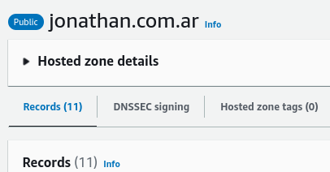
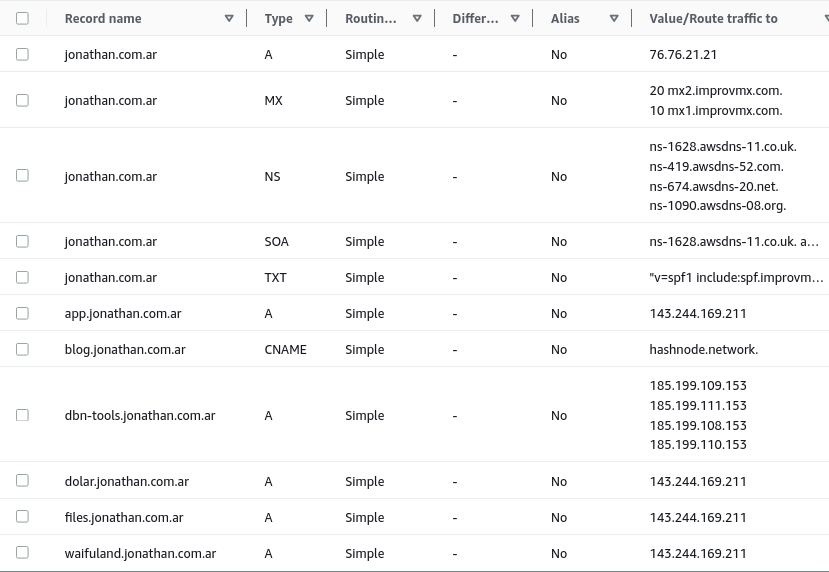

# Work in progress - Networking 🧲

Update 27/08/2023: Everything is working perfectly

Right now everything from nic.ar is being delegated to Route53, and from there to Vercel or DigitalOcean.

Now that I understand how DNS works, I don't break everything every time I touch something.

### Route 53

